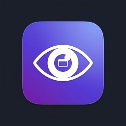
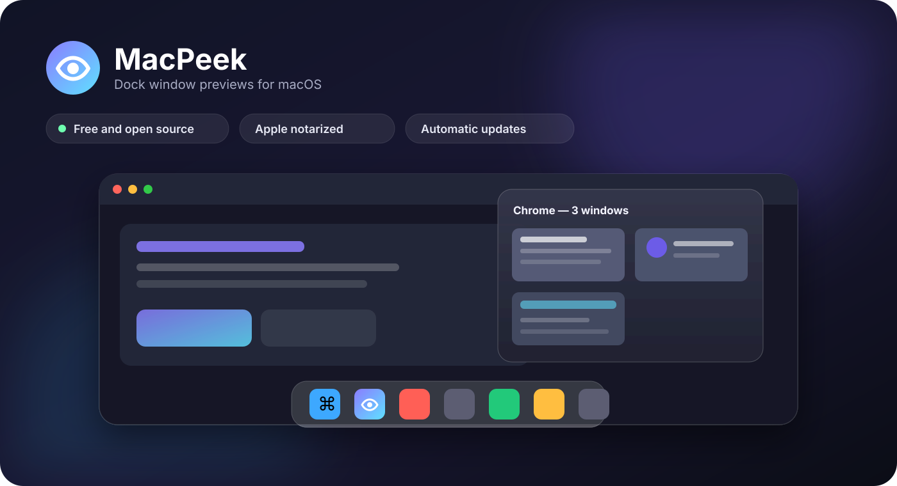
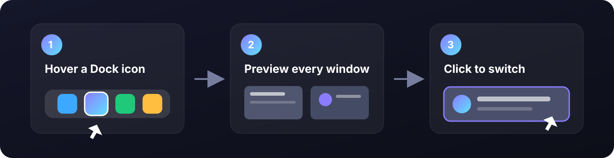

<p align="center">
  
</p>

<h1 align="center">MacPeek</h1>

<p align="center">Windows-style Dock previews for macOS — native, private, and free.</p>

<p align="center">
  
  
  
  
</p>



MacPeek adds Windows-style window previews to the macOS Dock. Hover over a running app, see its open windows, then click a thumbnail to switch directly to it.

<p align="center"><strong><a href="https://github.com/dangvanhai13091989/MacPeek/releases/latest/download/MacPeek.dmg">Download the latest notarized DMG</a></strong> · <a href="https://dangvanhai13091989.github.io/MacPeek/">Website</a> · <a href="https://paypal.me/HaiDang880">Donate with PayPal</a></p>

MacPeek is free and open source. Donations are optional and never unlock additional features.

## Features

- Dock window previews after a short hover delay
- Multi-window grid with pagination
- Click a thumbnail to focus that exact window
- Close individual windows from the preview
- Bottom, left, and right Dock positioning
- Multi-monitor support
- Launch at login
- Signed automatic updates through Sparkle and GitHub Releases
- 18 localizations with an English fallback
- No analytics, advertising, or screen-content uploads

## Installation

1. Download [`MacPeek.dmg`](https://github.com/dangvanhai13091989/MacPeek/releases/latest/download/MacPeek.dmg).
2. Open it and drag MacPeek into Applications.
3. Launch MacPeek and follow the permission setup.

The release is signed with a Developer ID certificate and notarized by Apple. MacPeek is distributed outside the Mac App Store because its Dock integration depends on Accessibility APIs that are incompatible with the App Store sandbox.

## How it works



## Permissions

MacPeek requires two macOS permissions:

- **Accessibility** identifies the Dock item under the pointer and raises or closes the selected window.
- **Screen Recording** creates local thumbnails of visible windows.

Thumbnails are held briefly in memory, are never written to disk, and are never uploaded. See [PRIVACY.md](PRIVACY.md) for details.

## Automatic updates

MacPeek uses [Sparkle 2](https://sparkle-project.org/) to check the signed [`appcast.xml`](appcast.xml) once per day. Every update archive is protected by an EdDSA signature in addition to Apple's Developer ID signature and notarization. A manual **Check for Updates…** command is available from the menu bar.

## Building from source

Requirements:

- macOS 14 or later
- Xcode 16 or later
- [XcodeGen](https://github.com/yonaskolb/XcodeGen)

```bash
git clone https://github.com/dangvanhai13091989/MacPeek.git
cd MacPeek
xcodegen generate
xcodebuild -project MacPeek.xcodeproj -scheme MacPeek -configuration Debug build CODE_SIGNING_ALLOWED=NO
```

The Xcode project is generated from [`project.yml`](project.yml). Avoid editing generated project settings without updating that file.

## Architecture

- `DockHoverMonitor` uses the macOS Accessibility API to detect Dock hover events.
- `WindowCaptureService` enumerates windows and captures thumbnails with ScreenCaptureKit.
- `PopupWindowController` hosts the SwiftUI preview in a nonactivating floating panel.
- `UpdateManager` owns the Sparkle update lifecycle.

## Contributing

Bug reports, pull requests, performance profiling, and translations are welcome. Read [CONTRIBUTING.md](CONTRIBUTING.md) before submitting a change. Please report security issues using the process in [SECURITY.md](SECURITY.md).

## Support

If MacPeek saves you time, you can [support ongoing development with PayPal](https://paypal.me/HaiDang880). You can also help by starring the repository, reporting reproducible bugs, or improving a translation.

## License

MacPeek is licensed under the [GNU General Public License v3.0](LICENSE).
